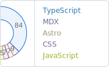
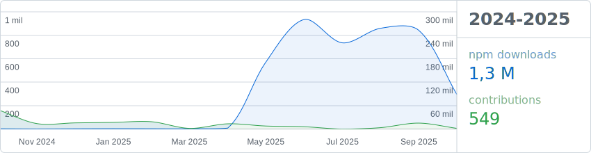

### Hola 👋

<picture>
  <source media="(prefers-color-scheme: dark)" srcset="assets/languages-dark.svg">
  
</picture>

- Principalmente **TypeScript**, **Astro**, **Angular** y algo de **React**.
- Todos mis proyectos están disponibles en [GitHub](https://github.com/adrian-ub).
- Puedes leer mi blog en [adrianub.dev](https://adrianub.dev/).

 

<picture>
  <source media="(prefers-color-scheme: dark)" srcset="assets/stats-dark.svg">
  
</picture>

  

- [Bordes rellenables con TailwindCSS](https://adrianub.dev/posts/bordes-rellenables-con-tailwindcss/)
- [Múltiples flujos con RxJS en Angular](https://adrianub.dev/posts/combinando-multiples-flujos-http-con-rxjs-observables-en-angular/)
- [Formularios reactivos en Angular con ControlValueAccessor](https://adrianub.dev/posts/crear-controles-de-formulario-personalizados-usando-controlvalueaccessor-en-angular/)
- [Cómo usar TailwindCSS v2 en Laravel 8](https://adrianub.dev/posts/como-usar-tailwindcss-v2-en-laravel-8/)
- [Como desplegar NestJS en Deta.sh 🚀](https://adrianub.dev/posts/desplegar-nestjs-en-detash/)
